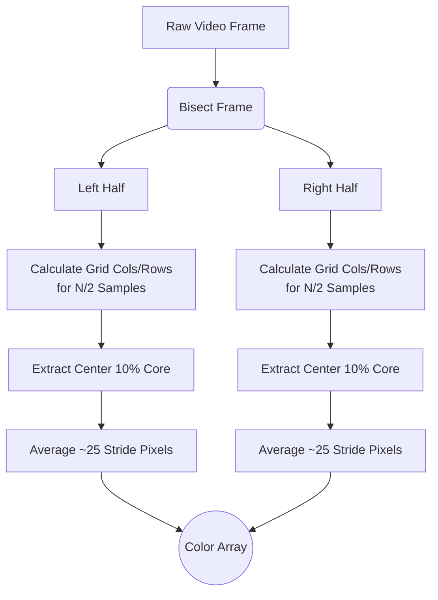
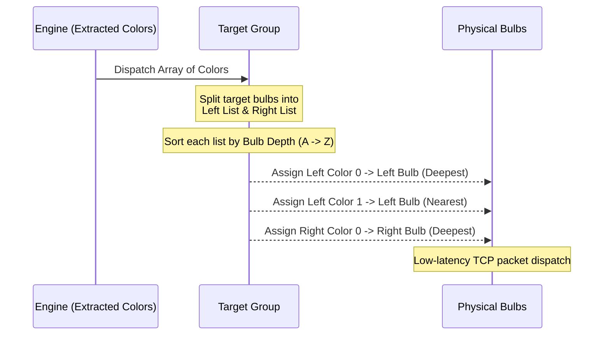

# LightboxController

LightboxController is a Windows desktop application built to give users direct, local control over Surplife/Luckystyle WiFi LED smart bulbs (manufactured by Zengge). It departs from standard mobile applications by offering a 3D spatial interface where users can add, label, arrange, and control multiple bulbs simultaneously on their local network.

The application uses a **C++ backend** for reliable local-network communication, and a **Qt 6 / Qt Quick 3D frontend** for the user interface.

## Features

- **Local Discovery & Registration**: Auto-discover Zengge/LEDENET bulbs on your local network via UDP (no cloud or internet access required).
- **Individual Bulb Control**: Direct control over Power, RGB Color, Brightness, and White Temperature (Warm to Cool).
- **3D Spatial Interface**: Visualize and interact with your bulb arrangements in a real-time 3D environment.
- **Group Settings**: Select and control multiple bulbs simultaneously through the 3D viewport.
- **Fast Local Networking**: Commands are dispatched via raw TCP using the 9-byte LEDENET protocol, ensuring low-latency responses over your local LAN.

## Technology Stack

- **Language**: C++17
- **Platform**: Windows Desktop
- **UI Framework**: Qt 6, Qt Quick 3D
- **Networking**: `QTcpSocket` / `QUdpSocket` (LEDENET Protocol on port 5577, Discovery on port 48899)
- **Persistence**: Qt JSON configuration

## Project Structure

- `src/` - Provides the C++ application backend and logic.
  - `Bulb` - Represents the state of a single physical bulb.
  - `BulbManager` - Central registry handling state, settings, and group selections.
  - `BulbScanner` - Network UDP discovery for finding Zengge bulbs on the LAN.
  - `ZenggeProtocol` - The TCP socket handler for issuing properly formatted 9-byte control packets.
- `qml/` - Contains the Qt Quick user interface configuration.
  - `Main.qml` - Main application window and 3D scene setup.
  - `DiscoverDialog.qml` - The network discovery and device addition screen.
  - `InspectorPanel.qml` - UI for tweaking colors, power, and options of selected bulbs.

## Building and Running

### Prerequisites
- Windows 10/11
- Qt 6 (with Qt Quick 3D and network components installed)
- CMake
- C++17 compatible compiler (e.g., MSVC, MinGW)

### Compiling

You can use the provided build scripts to configure and compile the project into the `build/` directory:

```bat
build.bat
```
*(Or use `.\build.ps1` if you are using PowerShell)*

### Running

After building successfully, run the application using:

```bat
run.bat
```
*(Or `.\run.ps1` if you are using PowerShell)*

## How It Works

LightboxController communicates directly with smart bulbs using the local network **LEDENET protocol**:
- **Discovery**: A UDP broadcast is sent on Port 48899 (`HF-A11ASSISTHREAD`). Responsive bulbs reply with their IP, MAC, and Model.
- **Control**: Once added, LightboxController opens a direct TCP connection to the bulb on Port 5577. It sends control instructions as raw byte-arrays (e.g. 9-byte commands mapping Color, Warm White, Cool White, and operation mode), terminating with a checksum. This allows it to instantly adjust device state without reliance on external servers.

## Video Pattern Sampling Algorithm

LightboxController features a custom **Spatial Video Pattern Engine** that dynamically extracts ambient lighting sequences from video files matching your physical bulb setup.

### 1. Spatial Frame Slicing
To ensure the lighting aligns with the spatial reality of your room, the video frame is bisected into **Left** and **Right** halves. Based on the selected `Sample Count`, the algorithm distributes the sampling points proportionately across the two halves (e.g., a 5-sample setup allocates 3 chunks to the left and 2 to the right).



#### Grid Index Mapping
To ensure consistent assignment, samples are indexed in a **row-major** order within each half. For a standard 12-sample configuration (6 per side), the mapping follows a 2x3 grid:

| | Left Side (L) | | | Right Side (R) | |
| :---: | :---: | :---: | :---: | :---: | :---: |
| **L1** | | **L2** | **R1** | | **R2** |
| **L3** | | **L4** | **R3** | | **R4** |
| **L5** | | **L6** | **R5** | | **R6** |

- **L1 / R1**: Maps to the Top-Left corner of the respective half.
- **L2 / R2**: Maps to the Top-Right corner.
- **L6 / R6**: Maps to the Bottom-Right corner.

Indices are then dispatched to bulbs on that side based on their physical **Depth** sorting. For instance, `L1` (the top-left visual area) will be assigned to the deepest background bulb on the left side.

### 2. High-Performance Core Sampling
Instead of expensively averaging millions of pixels per frame, the engine employs a "center 10% core" heuristic for each generated chunk.

- **Bounding Box Calculation**: The spatial center of each chunk is found. A bounding box equivalent to 10% of the chunk's total area is computed to avoid edge letterboxing.
- **Strided Pixel Averaging**: Within this inner core, a grid is established using uniform strides to guarantee ~25 distinct sample points.
- **Result**: These pixels are averaged to represent the dominant RGB color of that chunk, drastically reducing CPU overhead while accurately capturing the focal lighting of that screen region. The extractor algorithm is also throttled to evaluate frames precisely at 5fps.

### 3. Spatial Bulb Assignment
Once the color array for a frame is extracted natively, the system must dispatch it to the appropriate physical bulbs in real-time.

The engine inspects the metadata mathematically assigned to every bulb in the `Target Bulbs` list:
- **Left/Right Isolation**: Bulbs explicitly flagged as "Left" or "Right" receive color data only originating from the respective half of the video.
- **Depth Sorting**: Crucially, bulbs are sorted by their **Depth** property (Z-axis depth from the viewport) prior to assignment. Visual color samples map gracefully from the "deepest" background bulb to the nearest front-facing bulb on that side.


