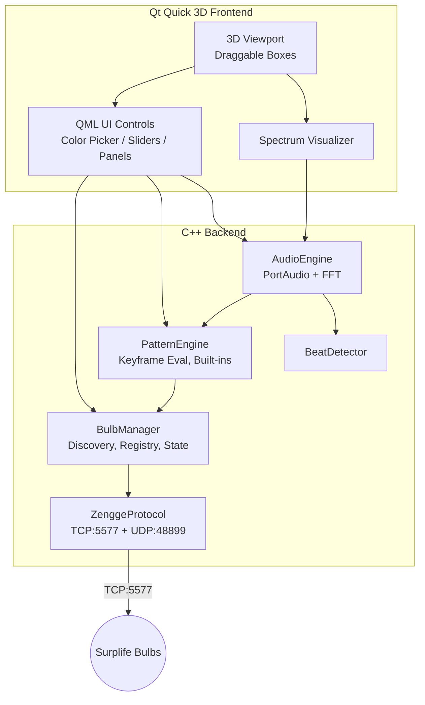

# LightboxController — Product Requirements Document

> [!NOTE]
> **Confirmed specs**: 9-byte LEDENET protocol, RGB + Warm White + Cool White, max 3 parallel TCP connections (sequential dispatch beyond 3 bulbs).

## 1. Overview

**LightboxController** is a Windows desktop application for controlling Surplife/Luckystyle WiFi LED smart bulbs (manufactured by **Zengge**). It provides a 3D spatial interface where users can add, label, arrange, and control an unlimited number of bulbs—individually or in groups. The application features real-time audio reactivity (live microphone or audio file), custom lighting patterns, and full color/brightness control. The backend is built in **C++** with a **Qt 6 / Qt Quick 3D** frontend.

---

## 2. Problem Statement

The stock Surplife app lacks spatial awareness, advanced group control, pattern programming, and audio-reactive modes. Users who want to create immersive lighting setups across multiple bulbs need a tool that:

- Lets them **visualize** bulb placement in 3D space
- Enables **fine-grained control** of color, brightness, and white temperature
- Supports **audio-reactive** lighting from live mic input or audio files
- Provides **custom pattern** creation and playback
- Scales to **any number** of bulbs with a modular add-as-you-go workflow

---

## 3. Target User

Hobbyist/DIY lighting enthusiasts, streamers, musicians, and home ambience designers who own multiple Surplife/Luckystyle WiFi LED bulbs and want centralized, programmable control beyond the stock app.

---

## 4. Technical Foundation

### 4.1 Hardware: Surplife / Luckystyle LED Bulbs

| Detail | Value |
|---|---|
| **Brand** | Luckystyle / Surplife (sold on [Amazon.ca](https://www.amazon.ca/dp/B0F8HPPZVT)) |
| **Manufacturer** | Zengge |
| **Connectivity** | 2.4 GHz WiFi (no hub required) |
| **Color** | RGB 16 million colors + tunable white (2700K–6500K) |
| **App** | Surplife (official), Magic Home (compatible) |
| **Base** | E26/A19 standard |

### 4.2 Bulb Communication Protocol — LEDENET (Zengge)

These bulbs use the **LEDENET protocol**, reverse-engineered by the [flux_led](https://github.com/beville/flux_led) project. All communication is over **raw TCP on port 5577**. Commands are byte arrays with a checksum (sum of all bytes & 0xFF) appended as the final byte.

#### Discovery — UDP Port 48899

| Step | Detail |
|---|---|
| Broadcast `HF-A11ASSISTHREAD` to UDP port 48899 | Bulbs respond with `IP,MAC,MODEL` (e.g. `192.168.1.100,B4E842E10588,AK001-ZJ2145`) |
| Broadcast `AT+LVER\r` to same port | Bulbs respond with firmware version: `+ok=07_06_20210106_ZG-BL\r` |
| Parse response | Extract IP, MAC ID, model number, firmware version |

#### Command Reference — TCP Port 5577

All commands are sent as raw byte arrays. The last byte is a **checksum** = `sum(all_preceding_bytes) & 0xFF`.

##### Power Control

| Command | Bytes | Notes |
|---|---|---|
| **Power ON** | `[0x71, 0x23, 0x0F, checksum]` | `0x23` = on |
| **Power OFF** | `[0x71, 0x24, 0x0F, checksum]` | `0x24` = off |

##### State Query (confirmed 14-byte / 9-byte variant)

| Command | Bytes | Response |
|---|---|---|
| **Query State** | `[0x81, 0x8A, 0x8B, checksum]` | 14-byte response: `[head, model, power, pattern, mode, speed, R, G, B, WW, version, CW, color_mode, checksum]` |

##### Color / Level Control (LEDENET 9-byte — confirmed)

```
Byte layout:
 0: 0x31 (persist) or 0x41 (volatile)
 1: Red   (0–255)
 2: Green (0–255)
 3: Blue  (0–255)
 4: Warm White (0–255)
 5: Cool White (0–255)
 6: Write Mode — 0xF0 (color only), 0x0F (white only), 0x00 (both)
 7: 0x0F (terminator)
 8: checksum
```

##### Preset Patterns

| Command | Bytes | Notes |
|---|---|---|
| **Set Preset** | `[0x61, pattern_code, delay, 0x0F, checksum]` | `delay` = speed-to-delay conversion; pattern codes 0x25–0x38 |
| **Set Preset (dimmable)** | `[0x38, pattern_code, delay, brightness, checksum]` | Allows brightness control on patterns |

##### Custom Effects

```
Byte layout:
 [0x51, R1, G1, B1,   ← first color (lead byte 0x51)
  0x00, R2, G2, B2,   ← subsequent colors (lead byte 0x00)
  ...                  ← up to 16 colors, pad empty with [0x00, 0x01, 0x02, 0x03]
  0x00,                ← padding
  delay,               ← speed (0–255, derived from %)
  transition_type,     ← 0x3A=gradual, 0x3B=jump, 0x3C=strobe
  0xFF, 0x0F,          ← terminators
  checksum]
```

##### Music Mode

| Command | Bytes | Notes |
|---|---|---|
| **Music On** | `[0x73, 0x01, sensitivity, 0x0F, checksum]` | `sensitivity` 0x00–0x64 (0–100) |
| **Music Off** | `[0x73, 0x00, 0x59, 0x0F, checksum]` | Pauses music mode |
| **Mic Effect** | `[0x37, effect, 0x00, checksum]` | `effect`: 0x00=Fade In, 0x01=Gradual, 0x02=Jump, 0x03=Strobe |

#### Checksum Calculation

```
checksum = (sum of all preceding bytes) & 0xFF
```

### 4.3 C++ Protocol Functions

The following functions must be implemented in a `ZenggeProtocol` class using raw TCP sockets (Winsock2 or Qt's `QTcpSocket`):

```cpp
class ZenggeProtocol {
public:
    // Connection
    bool connect(const std::string& ip, uint16_t port = 5577);
    void disconnect();
    bool isConnected() const;

    // Discovery (static, UDP broadcast)
    static std::vector<BulbInfo> discoverBulbs(int timeoutMs = 5000);

    // Power
    void powerOn();
    void powerOff();

    // State
    BulbState queryState();

    // Color & Brightness
    void setColor(uint8_t r, uint8_t g, uint8_t b, bool persist = true);
    void setWarmWhite(uint8_t level, bool persist = true);
    void setCoolWhite(uint8_t level, bool persist = true);
    void setWhite(uint8_t warm, uint8_t cool, bool persist = true);
    void setColorAndWhite(uint8_t r, uint8_t g, uint8_t b,
                          uint8_t warm, uint8_t cool, bool persist = true);

    // Preset Patterns
    void setPresetPattern(uint8_t patternCode, uint8_t speed);
    void setPresetPatternDimmable(uint8_t patternCode, uint8_t speed, uint8_t brightness);

    // Custom Effects
    void setCustomEffect(const std::vector<std::tuple<uint8_t,uint8_t,uint8_t>>& colors,
                         uint8_t speed, TransitionType transition);

    // Music Mode
    void enableMusicMode(uint8_t sensitivity);
    void disableMusicMode();
    void setMicEffect(MicEffect effect);

    // Clock
    void syncClock();

    // Timers
    std::vector<Timer> getTimers();
    void setTimer(uint8_t num, TimerMode mode, const TimerSettings& settings);

private:
    void sendCommand(const std::vector<uint8_t>& bytes);
    std::vector<uint8_t> receiveResponse(size_t expectedLen);
    static uint8_t checksum(const std::vector<uint8_t>& bytes);
    static uint8_t speedToDelay(uint8_t speed);
};
```

### 4.4 Technology Stack

| Layer | Technology |
|---|---|
| **Language** | C++17 |
| **Platform** | Windows 10/11 only |
| **GUI Framework** | Qt 6 (Qt Quick 3D for 3D viewport, Qt Quick/QML for 2D controls) |
| **3D Rendering** | Qt Quick 3D (built-in PBR renderer) |
| **Audio I/O** | PortAudio (low-latency mic capture, file playback) |
| **Audio Formats** | WAV, MP3 |
| **Audio Analysis** | KFR or custom FFT (spectral analysis + beat detection) |
| **Networking** | QTcpSocket / QUdpSocket (LEDENET 9-byte protocol on port 5577) |
| **Connection Strategy** | Up to 3 parallel TCP connections; bulbs beyond 3 dispatched sequentially |
| **Build System** | CMake |
| **Persistence** | JSON config files (Qt JSON classes) |

---

## 5. Feature Requirements

### 5.1 Bulb Discovery & Registration (P0)

| ID | Requirement |
|---|---|
| BR-1 | Auto-discover Zengge/LEDENET bulbs via UDP broadcast to port 48899 |
| BR-2 | Display discovered bulbs with IP, MAC, model, firmware version, online/offline status |
| BR-3 | Allow manual entry of IP address for bulbs not auto-discovered |
| BR-4 | Persist registered bulbs in a JSON config so they survive app restarts |
| BR-5 | Support adding/removing bulbs at any time (hot-plug modular design) |
| BR-6 | No hard limit on number of bulbs — scales to however many the user adds |
| BR-7 | Use 9-byte LEDENET protocol (confirmed for these bulbs) |

### 5.2 Individual Bulb Control (P0)

| ID | Requirement |
|---|---|
| BC-1 | Power on / off |
| BC-2 | Set color via HSV color picker (converted to RGB for protocol) |
| BC-3 | Set brightness (0–100%, mapped to RGB scaling or warm white level) |
| BC-4 | Set white temperature (2700K–6500K warm-to-cool slider) |
| BC-5 | Real-time preview: the 3D box representing the bulb glows with the current color |
| BC-6 | Latency target: < 50ms from UI action to bulb response on LAN |

### 5.3 Group / Multi-Bulb Control (P0)

| ID | Requirement |
|---|---|
| GC-1 | Select multiple bulbs (click, shift-click, drag-select in 3D viewport) |
| GC-2 | Apply color/brightness/temp changes to all selected bulbs simultaneously |
| GC-3 | Create named **groups** (e.g. "Desk", "Ceiling", "Left Wall") |
| GC-4 | Apply controls to an entire group with one action |
| GC-5 | A bulb can belong to multiple groups |

### 5.4 3D Spatial Interface (P0)

| ID | Requirement |
|---|---|
| UI-1 | Each registered bulb is represented as a **3D box** in the viewport |
| UI-2 | Boxes are **draggable** in 3D space (constrained or free axis movement) |
| UI-3 | Boxes are **labelable** — editable text label hovers above each box |
| UI-4 | Box **emits light/glow** matching the bulb's current color and brightness |
| UI-5 | Camera orbit, pan, zoom via mouse / scroll |
| UI-6 | Grid floor for spatial reference |
| UI-7 | Bulb positions and labels persist across sessions |
| UI-8 | Selection highlight (outline or glow change) on selected bulbs |

### 5.5 Lighting Patterns (P1)

| ID | Requirement |
|---|---|
| LP-1 | Built-in patterns: all LEDENET preset patterns (seven color cross fade, red gradual, green gradual, blue gradual, etc. — codes 0x25–0x38) |
| LP-2 | Configurable pattern parameters: speed, transition type (jump/gradual/strobe) |
| LP-3 | Assign patterns per-bulb or per-group |
| LP-4 | **Custom pattern editor**: define up to 16 colors, pick transition type and speed |
| LP-5 | **Keyframe timeline**: time-based pattern editor for complex sequences across multiple bulbs |
| LP-6 | Save/load custom patterns to/from JSON files |
| LP-7 | Pattern preview on the 3D boxes in real-time before pushing to hardware |

### 5.6 Audio Reactivity (P1)

| ID | Requirement |
|---|---|
| AR-1 | **Live audio** mode: capture system microphone input in real-time via PortAudio |
| AR-2 | **Audio file** mode: load a WAV or MP3 file and drive lights from its waveform |
| AR-3 | Real-time FFT spectral analysis with configurable band count |
| AR-4 | **Mapping modes**: map frequency bands to individual bulbs or groups (e.g., bass → Group A, treble → Group C) |
| AR-5 | **Beat detection**: detect beats and trigger color/brightness pulses |
| AR-6 | **Sensitivity** and **smoothing** controls to tune responsiveness |
| AR-7 | Visual spectrum analyzer display in the UI alongside the 3D viewport |
| AR-8 | Audio playback transport controls (play, pause, seek) for file mode |
| AR-9 | Option to use the bulbs' built-in music mode (`0x73` command) as a lightweight alternative |

### 5.7 Scenes & Presets (P2)

| ID | Requirement |
|---|---|
| SP-1 | Save full scene state (all bulb colors, brightness, patterns, positions) as a named preset |
| SP-2 | One-click recall of saved presets |
| SP-3 | Import/export presets as JSON for sharing |

---

## 6. Architecture Overview



### Key Classes

| Class | Responsibility |
|---|---|
| `BulbManager` | Owns the registry of all bulbs, handles discovery, exposes Q_PROPERTY for QML binding |
| `Bulb` | Represents one physical bulb: IP, MAC, model, current state (color, brightness, power, mode) |
| `ZenggeProtocol` | Implements LEDENET protocol: TCP connect, byte-array command construction, checksum, send/receive |
| `PatternEngine` | Evaluates built-in and custom patterns at a configurable tick rate, pushes state to `BulbManager` |
| `AudioEngine` | Wraps PortAudio stream, runs FFT per audio frame, exposes band magnitudes |
| `BeatDetector` | Analyzes spectral flux for onset/beat detection, emits signals on beats |
| `SceneManager` | Save/load full application state (bulb positions, groups, patterns, presets) as JSON |

---

## 7. UI Layout

```
┌─────────────────────────────────────────────────────────────┐
│  Toolbar: [Discover] [Add Bulb] [Groups ▼] [Scenes ▼]      │
├───────────────────────────────────────┬─────────────────────┤
│                                       │  Inspector Panel    │
│                                       │  ┌───────────────┐  │
│       3D Viewport                     │  │ Label: ______ │  │
│       (draggable bulb boxes,          │  │ Color: [●]    │  │
│        orbit camera, grid)            │  │ Brightness: ─●│  │
│                                       │  │ Temp: ─●──    │  │
│                                       │  │ Group: [...]  │  │
│                                       │  │ Pattern: ▼    │  │
│                                       │  └───────────────┘  │
├───────────────────────────────────────┤─────────────────────┤
│  Audio Panel (collapsible)            │  Pattern Timeline   │
│  [🎤 Live] [📁 File] Sensitivity: ─● │  (keyframe editor)  │
│  ┌─ Spectrum ─────────────────┐       │                     │
│  │ ▁▂▃▅▇█▇▅▃▂▁               │       │                     │
│  └────────────────────────────┘       │                     │
└───────────────────────────────────────┴─────────────────────┘
```

---

## 8. Non-Functional Requirements

| Category | Requirement |
|---|---|
| **Performance** | 60 FPS 3D viewport with ≤ 200 bulbs rendered; audio processing at ≤ 10ms latency |
| **Platform** | Windows 10/11 only |
| **Networking** | All communication stays on local LAN — no cloud, no Tuya, no BLE |
| **Persistence** | All config (bulbs, groups, positions, presets, patterns) stored in `%APPDATA%/LightboxController/` as JSON |
| **Extensibility** | Plugin-friendly pattern engine; new pattern types can be added as subclasses |

---

## 9. Milestones

| Phase | Scope | Priority |
|---|---|---|
| **M1 — Core Control** | ZenggeProtocol (TCP:5577), bulb discovery (UDP:48899), single-bulb color/brightness/power control, basic 3D viewport with static boxes | P0 |
| **M2 — 3D Interaction** | Draggable boxes, labels, camera controls, selection, multi-bulb control, groups | P0 |
| **M3 — Patterns** | Built-in LEDENET presets, custom effects (up to 16 colors), pattern engine tick loop, keyframe editor | P1 |
| **M4 — Audio** | PortAudio integration, FFT, beat detection, audio-to-light mapping, spectrum visualizer, WAV/MP3 support | P1 |
| **M5 — Scenes & Polish** | Scene save/load, presets, UI polish, performance optimization | P2 |

---

## 10. Resolved Questions

| # | Question | Answer |
|---|---|---|
| 1 | Protocol variant | **9-byte LEDENET** (confirmed) |
| 2 | White LED type | **RGB + Warm White + Cool White** (full 9-byte color+white support) |
| 3 | Max concurrent TCP | **3–5 stable**; dispatch sequentially after 3 parallel connections |
